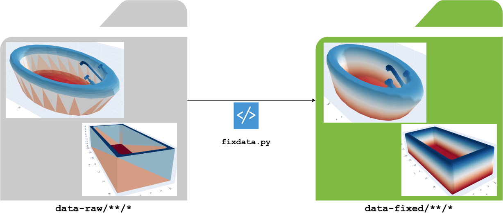

```
Usage: fixdata.py [OPTIONS]

  Fix a 3D dataset recursively to enforce watertight manifolds, it is copy-
  only. It does not change the source.

  It uses the Manifold tool: https://github.com/hjwdzh/Manifold

Options:
  --resolution INTEGER            the number of leaf nodes of octree. The face
                                  number increases linearly with the
                                  resolution.  [default: 5000]

  --simplify / --no-simplify      if True, tries to simplify the obtained
                                  manifold  [default: False]

  --manifold-check / --no-manifold-check
                                  Turn on manifold check, we don't output
                                  model if check fails  [default: True]

  --face-num INTEGER              Add termination condition when
                                  current_face_num <= face_num  [default:
                                  5000]

  --max-cost FLOAT                Add termination condition when quadric error
                                  >= max_cost  [default: 1e-06]

  --max-ratio FLOAT               Add termination condition when
                                  current_face_num / origin_face_num <=
                                  max_ratio  [default: 0.4]

  --workers INTEGER               if True parallelize the transformation
                                  [default: 8]

  --parallel / --no-parallel      the number of workers to use if parallel is
                                  enabled  [default: True]

  --source TEXT                   the source folder  [default: data-raw]
  --target TEXT                   the target folder  [default: data-fixed]
  --manifold-exec TEXT            the manifold executable. If None uses the
                                  one define in .env or in the path

  --simplify-exec TEXT            the simplify executable. If None uses the
                                  one define in .env or in the path

  --install-completion [bash|zsh|fish|powershell|pwsh]
                                  Install completion for the specified shell.
  --show-completion [bash|zsh|fish|powershell|pwsh]
                                  Show completion for the specified shell, to
                                  copy it or customize the installation.

  --help                          Show this message and exit.
```
